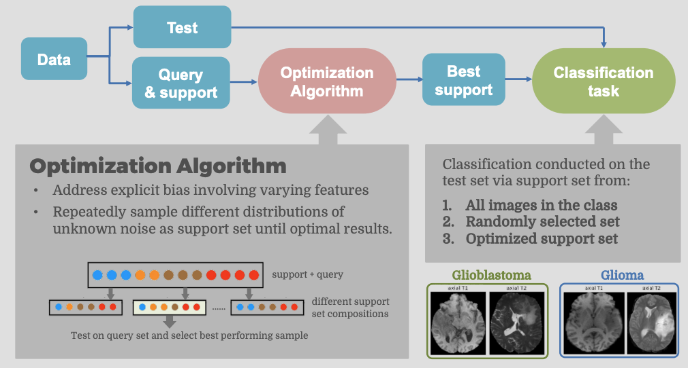
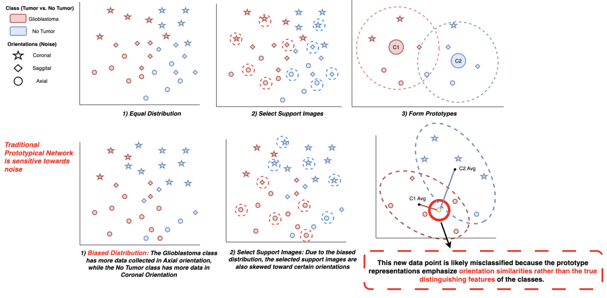
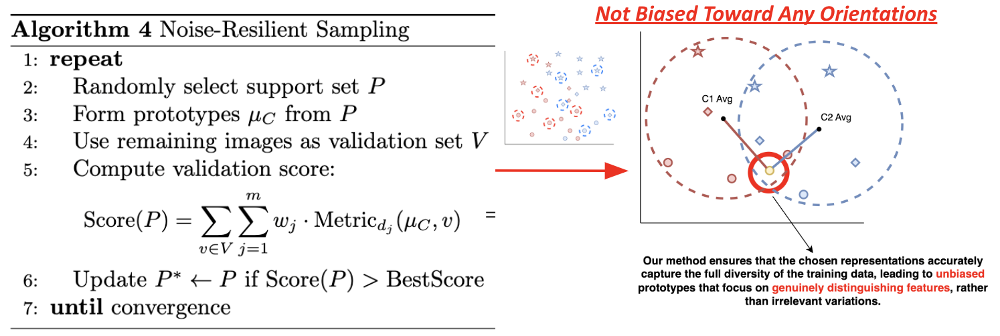
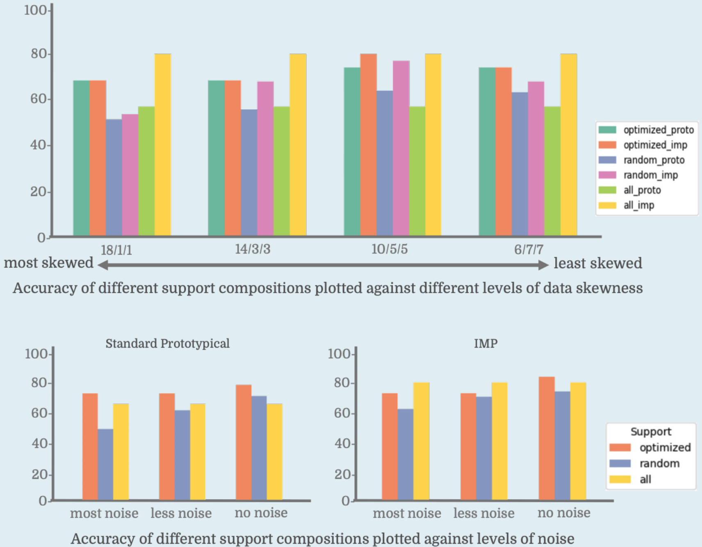

# Toward Noise-Resilient Few-Shot Learning: Optimizing Prototypes for Glioblastoma Classification
  &nbsp;&nbsp;&nbsp;&nbsp;&nbsp;

This official repository holds code for our 2024 Carleton CS Comps  project. We open source all code and results here under a [permissive MIT license](LICENSE), to encourage reproduction and further research exploration. 

## Introduction

Few-Shot Learning (FSL), inspired by the adaptability of human cognition, is a widely used methodology for scenarios with limited data samples. Prototype-based methods are a classical and popular subset of FSL techniques. However, these methods can be particularly vulnerable to the selection of samples used to form prototypes, especially when unintentional noise is introduced.

To address this limitation, we present a framework designed to optimize the sampling process, making it more robust to noise. We experiment on classification of Glioblastoma, an aggressive and heterogeneous brain tumor. We model the unexpected variability introduced by different orientations, imaging techniques, resolutions, and other factors.

Our method consistently enhances the performance of both the original Prototypical Network and the Infinite Prototypical Network, demonstrating improved resilience and reliability across diverse conditions.

<table class="center">
    <tr>
        <td width=100% style="border: none"></td>
    </tr>
</table>

## Algorithm

To motivate our approach, consider the example in the figure below. Traditional Prototypical Networks are sensitive to noisy and heterogeneous data, such as variations in collected brain orientations (e.g., coronal, sagittal, and axial orientations). This often leads to biased prototypes that fail to capture the true distinguishing features of classes, resulting in misclassification.

*Motivating Example: Challenges faced by traditional Prototypical Networks under noise and bias.*

To address these challenges, we propose a **Noise-Resilient Sampling Framework**. Our method optimizes prototype formation through an iterative process that selects representative support samples, reduces noise impact, and improves resilience to data heterogeneity. Key steps include support set refinement, prototype scoring with a validation set, and iterative updates to enhance classification performance.

By iteratively refining the support set and using validation scores, our framework ensures prototypes are robust to noise and bias. This process enhances the performance of both Prototypical Networks and Infinite Prototypical Networks (IMP), consistently improving classification accuracy across heterogeneous datasets. The algorithm shown outlines the Noise-Resilient Sampling process. It begins by randomly selecting a support set, forming prototypes, and evaluating their performance on a validation set. This process iteratively refines the support set until an optimal configuration is reached.

## Result

<table class="center">
    <tr>
        <td width=100% style="border: none"></td>
    </tr>
    <tr>
        <td width="100%" style="border: none; text-align: center; word-wrap: break-word">Our method consistently improves the performance of Prototypical Networks and IMP in handling heterogeneous data.</td>
    </tr>
</table>

## Repo Structure

[Add a short description of code / code struture after finishing the code part]

## Get Started 

Coming Soon

## Getting in Touch

* For general questions and discussions, please use [GitHub Discussions](https://github.com/lean-dojo/LeanCopilot/discussions). 

* To report a potential bug, please open an issue. In the issue, please include the exact steps to reproduce the error, and complete logs. The more details you provide, the better we will be able to help you.

* Feature requests and other suggestions are extremely welcome. Please feel free to start a discussion!

## License

This project is licensed under the MIT License - see the [LICENSE](LICENSE) file for details.

## Citation

If you find our work helpful, we’d really appreciate it if you could give our repo a star!
